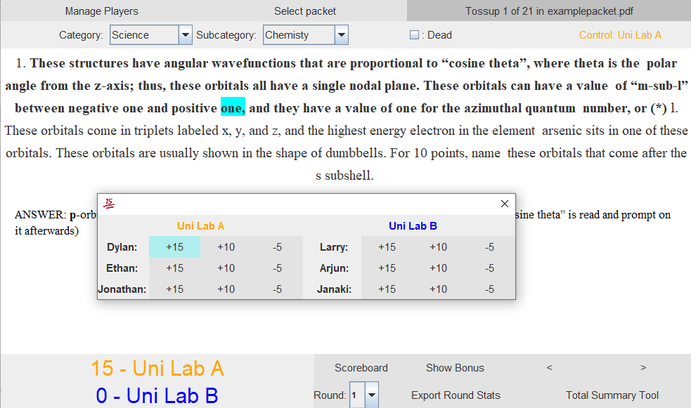
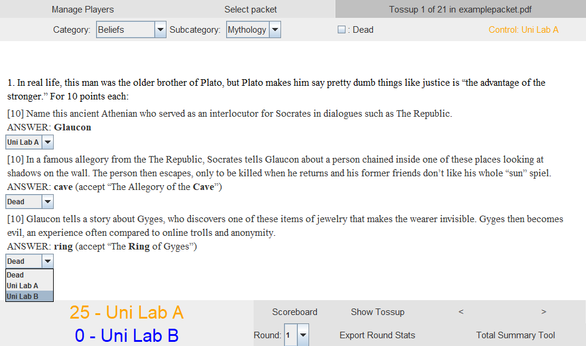
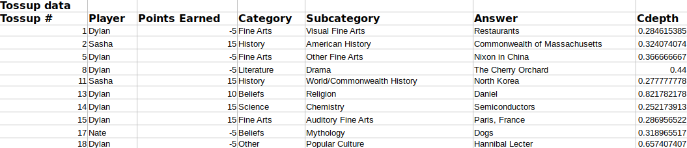
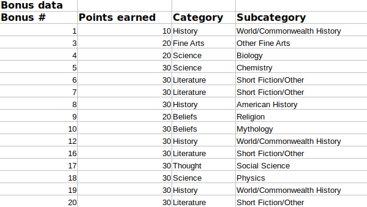
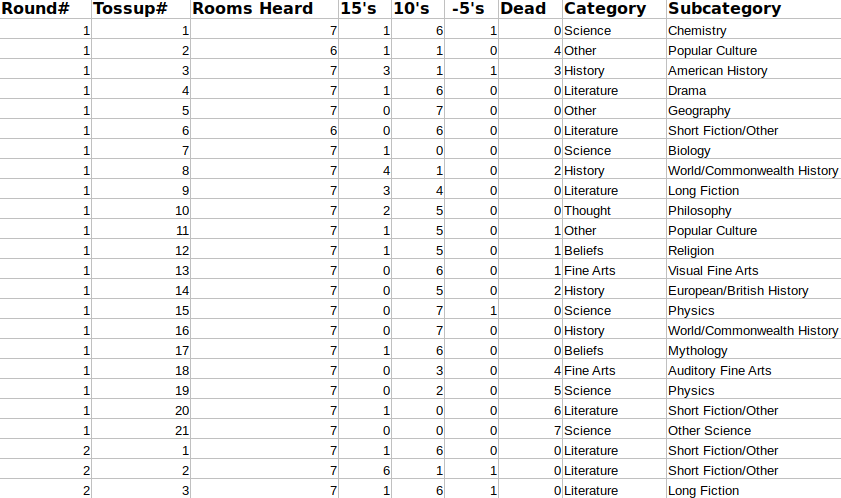
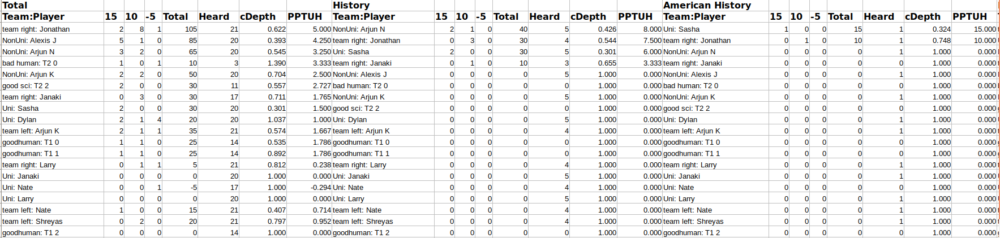
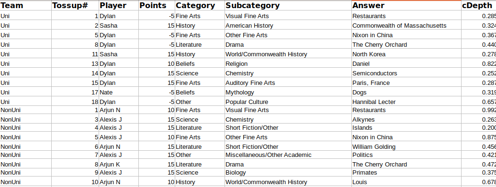

## Combining score keeping and moderating with simple GUI

## Easily generate round by round stats in human readable Excel files
- Buzzpoints in cDepth
- Powers/Tossups/Negs
- Category/Subcategory
- Points per Bonus
- Points per Tossup Heard

### Spreadsheet of buzzes during the round

### Spreadsheet of bonuses heard

## Comprehensive tournament stats compilation
- Every recorded buzz from every round
- Teams and Players ranked by *every* category
	- Which team had the highest PPB in Literature?
	- What about American Lit?
- Tossup and Bonus converion rates on every question
	- How many rooms bageled bonus 6 from Round 1?
	- How many rooms went dead on tossup 10 from Round 4?
	- What percentage of Myth tossups were powered?
	- What percentage of Sports bonuses were bageled?

### Conversion spreadsheet

### Ranking spreadsheet

### Spreadsheet of all buzzes

## Sample files for the Total Summary
These files were generated using TangStats when used to moderate a few games of Uni High practices as well as dummy games used for testing. These files are what the tournament wide stats summary will look like:
- [Ranking teams and players by PPB / PPTUH in every category](res/ranking.xlsx)
- [Conversion information on every tossup, bonus, and category](res/conversion.xlsx)
- [List of every buzz in the tournament](res/every_buzz.xlsx)

## About the program

### The program is written in Java 8 and uses
- Apache POI and Apache PDFBox for processing
- Apache HTTPClient, Node.js, and LowDB for server-client communication for lisencing
- Java Swing for GUI
### You only need to have a Java version ≥ 8 to run this program 
